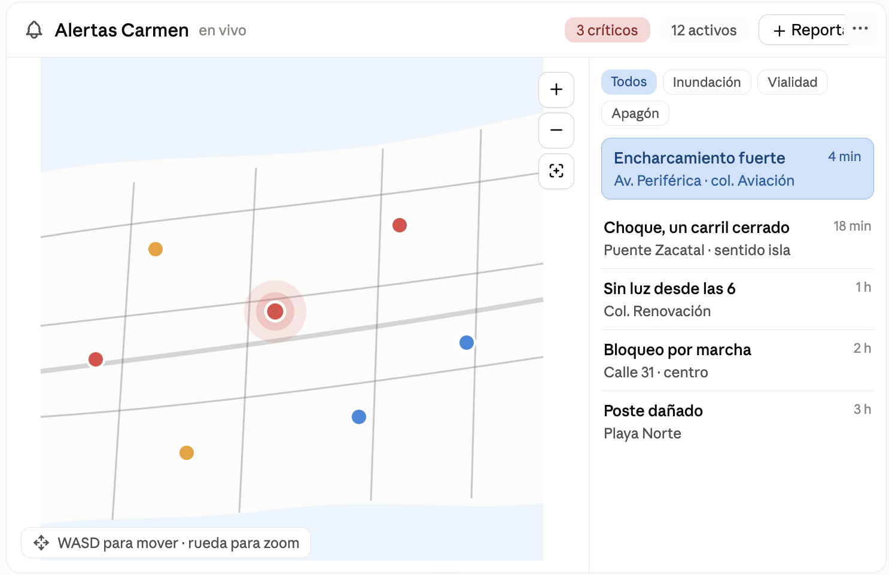

# Carmen Alerta

Frontend de Carmen Alerta creado con React, TypeScript y Vite.

## Desarrollo local

Necesitas Node.js 20.19 o superior. Después ejecuta:

```bash
npm install
npm run dev
```

Vite mostrará en la terminal la URL local de desarrollo (normalmente
`http://localhost:5173`).

## Comandos

- `npm run dev`: inicia el servidor de desarrollo con recarga rápida.
- `npm run build`: valida TypeScript y genera la versión de producción en `dist/`.
- `npm run preview`: sirve localmente la compilación de producción.

## Estructura principal

- `src/main.tsx`: punto de entrada de React.
- `src/App.tsx`: arma el layout (barra superior, mapa y panel de incidentes).
- `src/components/`: `TopBar`, `MapView` (mapa Leaflet) e `IncidentPanel`.
- `src/types.ts`: modelo compartido de categorías y reportes.
- `src/data/`: categorías, reportes de ejemplo y mapeo de filtros.
- `src/utils/formatReportAge.ts`: antigüedad calculada desde `createdAt`.
- `src/styles.css`: estilos globales y del layout.
- `vite.config.ts`: configuración de Vite y el plugin de React.
- `tsconfig*.json`: configuración de TypeScript para navegador y herramientas.

## Imagen de referencia



## Datos de ejemplo

Los incidentes de `src/data/reports.ts` son **ficticios** y sirven solo para
probar la interfaz. Las coordenadas corresponden a lugares reales de Ciudad
del Carmen consultados en OpenStreetMap (o en páginas de Mapcarta basadas en
OpenStreetMap): [Plaza Real](https://www.openstreetmap.org/way/224513587),
[Puente Zacatal](https://www.openstreetmap.org/#map=17/18.630331/-91.825908),
[terminal Playa Norte](https://www.openstreetmap.org/node/3221190021),
[Mercado Alonso Felipe de Andrade](https://www.openstreetmap.org/node/2332266585),
[colonia Playa Norte](https://www.openstreetmap.org/node/2332380663),
[Estadio Resurgimiento](https://www.openstreetmap.org/way/114002721),
[CETis 20](https://www.openstreetmap.org/way/1370895651),
[mercado](https://www.openstreetmap.org/node/14144914637),
[Hospital General](https://www.openstreetmap.org/way/1474191511) y
[Pemex Playa Norte](https://www.openstreetmap.org/way/524527997).

Al cambiar los reportes de ejemplo, el panel y los contadores se actualizan
desde el mismo estado de `App.tsx`. Los chips existentes muestran solo reportes
activos; la categoría «Otro» aparece únicamente al elegir «Todos».

## Crear reportes

El botón **Reportar** abre un formulario con categoría, descripción de hasta
140 caracteres, severidad y ubicación. La severidad es obligatoria según
`requiresSeverity`; si es opcional y se omite, se guarda como `low`.
La ubicación se obtiene mediante GPS (con permiso del navegador) o seleccionando
un punto del mapa. Con teclado, mueve el mapa con flechas/WASD y pulsa Enter
para seleccionar su centro. Escape permite volver al formulario desde el mapa
o cerrar el modal. Los campos se conservan durante la selección de ubicación.

Los reportes se agregan al estado de `App`, con fecha actual y estado
`unverified`, se muestran en Todos y quedan seleccionados. Se pierden al
recargar la página. No se incluyen archivos multimedia ni persistencia.

Integración de `MapView`: `pickingLocation` activa el selector;
`onMapClick({ latitude, longitude })` entrega el punto seleccionado y
`onCancelLocation()` vuelve al formulario. Estas propiedades son opcionales.